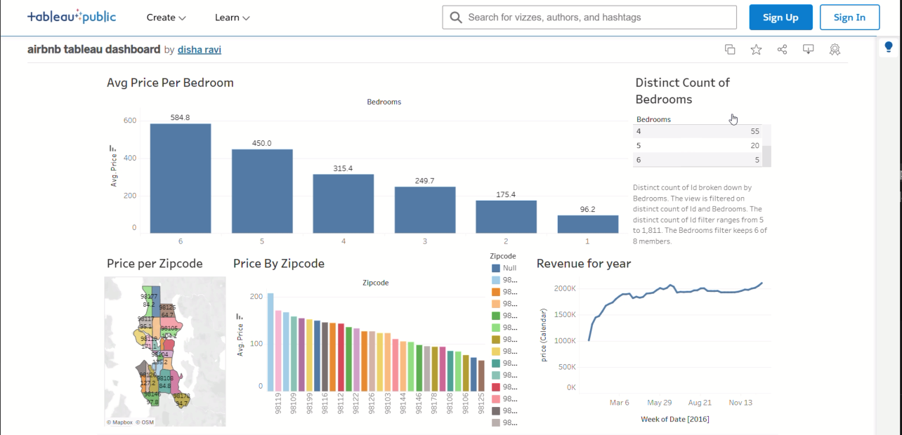

# 🏡 Airbnb Tableau Dashboard

This project is an **interactive Tableau dashboard** built to analyze Airbnb listing data.  
It highlights pricing trends, bedroom distribution, location-based insights, and yearly revenue patterns.

---

## 📊 Dashboard Preview

---

## 📂 Files in this Repository
- `airbnb tableau dashboard.twb` → Tableau workbook file  
- `bdd669a0-4667-473f-a53a-0b40f4b3ee87.png` → Screenshot preview of the dashboard  

---

## 📀 Dataset
The dataset used for this project is available on Kaggle:  
👉 [Airbnb Listings Dataset](https://www.kaggle.com/datasets/alexanderfreberg/airbnb-listings-2016-dataset)  

